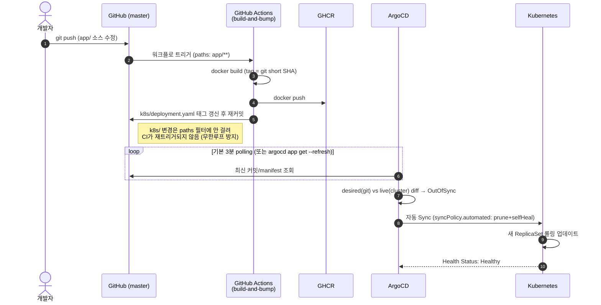

# ArgoCD Lab

로컬 macOS(Rancher Desktop)에서 실제 GitHub 저장소와 연동해 ArgoCD의 GitOps 흐름을
직접 눈으로 확인하기 위한 실습 프로젝트.

핵심 목표: **`app/` 소스 코드만 수정하고 `master`에 push하면**, 이미지 빌드부터
Kubernetes 배포까지 사람 개입 없이 전부 자동으로 이어지는 것을 확인한다.

```
소스 push → CI가 이미지 빌드/GHCR push → CI가 k8s manifest 태그 자동 갱신/커밋
   → ArgoCD가 감지 → 자동 Sync → k8s가 롤링 업데이트
```

## 사전 준비물

- [Rancher Desktop](https://rancherdesktop.io/) — Kubernetes 활성화, container engine: **dockerd(moby)**
- `kubectl`, `helm`, `docker` (Rancher Desktop 설치 시 `~/.rd/bin`에 함께 설치됨)
- `argocd` CLI (`brew install argocd`)
- `gh` CLI (`brew install gh`, 선택)
- GitHub 저장소에 push 가능한 인증(SSH 키 등)

## 저장소 구조

```
app/
├── index.html            # 배포 확인용 샘플 페이지 (버전 텍스트만 바꿔가며 테스트)
└── Dockerfile             # nginx:alpine + index.html

k8s/                       # ArgoCD가 감시하는 경로 (Application.spec.source.path)
├── deployment.yaml         # replicas, image 태그, revisionHistoryLimit 등
└── service.yaml            # LoadBalancer, localhost:8082 로 접속

argocd/
└── application.yaml        # ArgoCD Application CR (repo/branch/path, automated sync)

.github/workflows/
└── build-and-bump.yml      # app/ push 시 이미지 빌드→GHCR push→k8s manifest 태그 자동 커밋
```

## 로컬 환경 셋업

```bash
# 1. Kubernetes 활성화 (GUI 없이 CLI로)
rdctl start --kubernetes.enabled=true

# 2. ArgoCD 설치 (공식 manifest, CRD 용량 이슈로 server-side apply 사용)
kubectl create namespace argocd
kubectl apply -n argocd --server-side --force-conflicts \
  -f https://raw.githubusercontent.com/argoproj/argo-cd/stable/manifests/install.yaml
kubectl -n argocd wait --for=condition=available --timeout=300s deployment --all

# 3. ArgoCD 접속
kubectl -n argocd port-forward svc/argocd-server 8080:443 &
argocd login localhost:8080 --username admin --password admin --insecure
# admin 비밀번호는 이 랩에서 학습 편의를 위해 8자리 정책을 우회해 'admin'으로 고정해둠
# (argocd-secret을 직접 patch — 실제 운영 환경에서는 이렇게 하면 안 됨)

# 4. Application 등록
kubectl apply -f argocd/application.yaml
```

## CI/CD 흐름



- **ArgoCD가 실제로 감시하는 건 `k8s/` 경로뿐**이다. `app/` 소스 빌드나 GHCR push는
  ArgoCD 시야 밖이며, CI가 `k8s/deployment.yaml`을 다시 커밋해줘야 비로소 감지 대상이 된다.
- 기본 재동기화 주기는 **3분(polling)**. webhook은 구성하지 않음(로컬 환경을 외부에
  노출하지 않기 위해) — 즉시 확인하려면 `argocd app get argocd-lab --refresh`.
- `syncPolicy.automated`: `prune`(git에서 삭제된 리소스는 클러스터에서도 삭제),
  `selfHeal`(누가 `kubectl edit`로 직접 건드려도 git 상태로 되돌림).
- 이미지 태그는 커밋마다 **git short SHA**를 사용해 배포 이력을 그대로 추적 가능하게 함.

## 접속 정보

| 대상 | 주소 | 비고 |
|---|---|---|
| ArgoCD UI | https://localhost:8080 | `kubectl -n argocd port-forward svc/argocd-server 8080:443` 필요, admin/admin |
| 배포된 앱 | http://localhost:8082 | `k8s/service.yaml`이 `LoadBalancer`라 port-forward 불필요 |

> `type: ClusterIP` + `kubectl port-forward`로 시작했다가, 롤아웃마다 파드가 바뀌면서
> port-forward가 끊기는 문제가 있어 `LoadBalancer`(Rancher Desktop의 klipper/ServiceLB)로
> 전환함. 이후로는 재배포와 무관하게 `localhost:8082`가 항상 살아있다.

## 테스트 방법

```bash
# app/index.html 등 app/ 아래 소스만 수정
git add app/index.html && git commit -m "..." && git push origin master

# GitHub Actions 실행 확인 (또는 저장소 Actions 탭)
gh run watch

# ArgoCD가 감지해서 새 커밋으로 Sync 됐는지 확인
argocd app get argocd-lab --refresh

# 실제 반영 확인
curl localhost:8082
```

> `k8s/deployment.yaml`의 이미지 태그를 직접 손으로 바꿀 필요는 없다 — CI가 자동으로 처리한다.
> `app/`이 아니라 `k8s/`만 고쳐서 push하면(예: replica 수 변경) CI는 안 돌고 ArgoCD만 반응한다.

## 다음 학습 후보

- Argo CD Image Updater로 전환 (CI가 repo 쓰기 권한 없이도 태그 자동 갱신)
- webhook 연동으로 3분 polling 대신 즉시 감지 (ngrok 등으로 로컬 노출 필요)
- Kustomize/Helm 기반 매니페스트 관리, `kustomize edit set image`
- App of Apps, ApplicationSet, RBAC/SSO 등 ArgoCD 심화 기능
- CI가 직접 커밋하는 대신 PR을 생성하는 방식으로 전환
